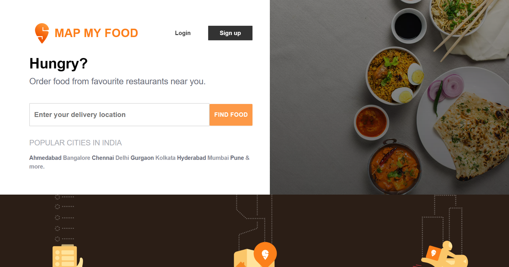
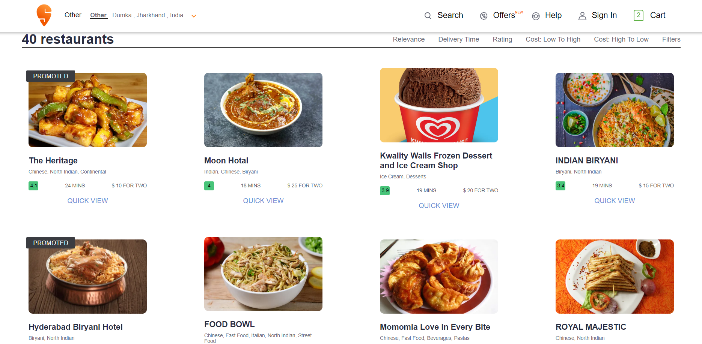
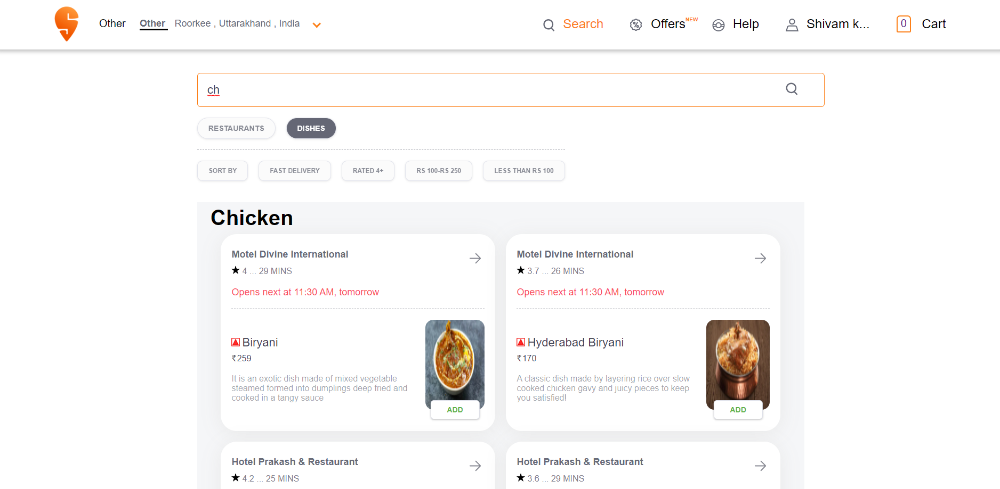
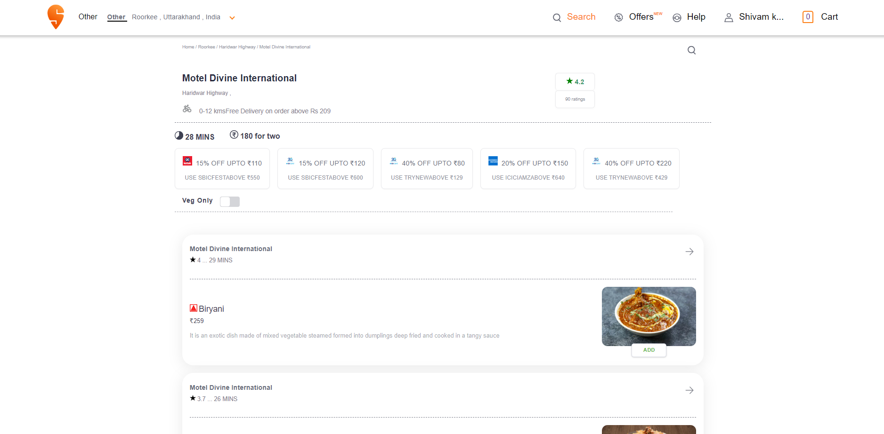
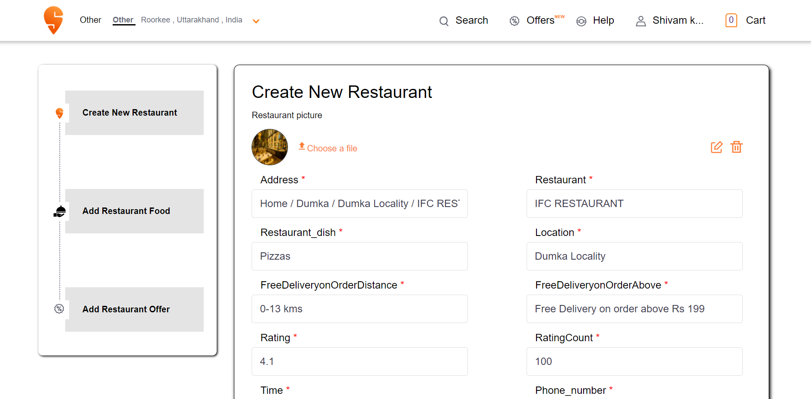

<br />
<div align="center">
<h2 align="center">Map my food</h2>

  <p align="center">
   Map My Food is a full-stack food order application built using React for the frontend, Node.js for the backend, and MongoDB for the database. With its responsive design and global state management, it offers a seamless and user-friendly experience for customers to explore and order food from various restaurants.It also offers a unique feature that allows new users to create their own restaurants within the app.
    <br />
    <br />
    <a href="https://github.com/shivam6862/Map-My-Food/issues">Report Bug</a>
    ·
    <a href="https://github.com/shivam6862/Map-My-Food/issues">Request Feature</a>
  </p>
</div>

<details>
  <summary>Table of Contents</summary>
  <ol>
    <li>
      <a href="#about-the-project">About The Project</a>
      <ul>
        <li><a href="#built-with">Built With</a></li>
      </ul>
    </li>
    <li><a href="#usage">Description</a></li>
    <li><a href="#usage">Snapshot Gallery</a></li>
    <li><a href="#contributing">Contributing</a></li>
    <li><a href="#contact">Contact</a></li>
    <li><a href="#acknowledgments">Acknowledgments</a></li>
  </ol>
</details>

## About The Project

Map My Food is an innovative food order app built on React, with a backend developed using Node.js and a MongoDB database. The app allows users to explore restaurants, browse menus, and place orders for delivery or pickup. With a map-based interface, responsive design, and global state management, Map My Food provides a seamless experience for users to discover and order delicious food. It incorporates intuitive search and filtering options and customizations for dietary preferences. Map My Food revolutionizes the way people interact with food delivery services, making it convenient and efficient for users to satisfy their cravings.It also offers a unique feature that allows new users to create their own restaurants within the app.Map My Food revolutionizes food delivery, providing convenience and efficiency for users to satisfy their cravings in a personalized way.

Team - `shivam6862`

<p align="right">(<a href="#readme-top">back to top</a>)</p>

### Built With

- [react-url]
- [NodeJs-url]
- [Mongodb-url]
- [VisualStudioCode-url]

<p align="right">(<a href="#readme-top">back to top</a>)</p>

## Getting Started

So as to run our project locally, you need to follow the steps below.

### Installation

1. Clone the repo
   ```sh
   git clone https://github.com/shivam6862/Map-My-Food.git
   ```
2. Install NPM packages on frontend_map_my_food folders
   ```sh
   npm install
   ```
3. Enter your BACKEND URL in `.env` of frontend_map_my_food directory
   ```sh
   VITE_REACT_BACKEND_URL=http://localhost:8080
   ```
4. Run the project in frontend_map_my_food using
   ```sh
   npm run dev
   ```
5. You can now view the project at `http://127.0.0.1:5173/`

6. Install NPM packages on Backend folders
   ```sh
   npm install
   ```
7. Enter your MONGODB DATABASE URL and put it in `.env` file in backend directory
   ```sh
   MONGODB_URL= "your mongodb url"
   ```
8. Make the database in your mongodb server named as `Map-My-Food` and make the following collection and set the data from `./Database/file`
   ```sh
   PaymentOffers
   orders
   otps
   restaurant
   restaurantFood
   restaurantOffers
   smallSearch
   users
   ```
9. Run the project in backend using
   ```sh
   npm start
   ```

<p align="right">(<a href="#readme-top">back to top</a>)</p>

<!-- USAGE EXAMPLES -->

## Description

Map My Food is a cutting-edge food order app designed to simplify the process of discovering and ordering food. Leveraging the power of React for the frontend, a Node.js backend, and MongoDB for the database, this application offers a seamless and user-friendly experience for food enthusiasts.<br/>

With its map-based interface, Map My Food allows users to explore a wide range of nearby restaurants and browse through their menus. The responsive design ensures a smooth and consistent experience across various devices, including mobile phones, tablets, and desktops. Whether users are on the go or at home, they can easily access the app and discover local culinary delights.<br/>

To enhance user convenience, Map My Food incorporates intuitive search and filtering options. Users can easily find their preferred cuisine or restaurant, saving time and effort. Additionally, the app allows users to customize their orders by specifying dietary preferences, special instructions, or any other preferences they may have. This level of personalization ensures that users can enjoy their meals exactly the way they desire.<br/>

One of the standout features of Map My Food is its global state management, which enables efficient data handling and synchronization across different components. This ensures a seamless navigation experience, allowing users to effortlessly add items to their cart and place orders without any interruptions. The app's intelligent backend, built on Node.js, facilitates smooth communication between the frontend and the database, ensuring a swift and reliable experience.<br/>

Map My Food revolutionizes the way people interact with food delivery services. By providing a user-friendly interface, a responsive design, and a comprehensive set of features, the app simplifies the entire process of discovering, exploring, and ordering food.Map My Food revolutionizes food delivery by empowering new restaurant owners to create their own establishments within the app. Users can explore a variety of restaurants, browse menus, and place orders for delivery or pickup. Whether users are craving a quick bite or planning a special meal, Map My Food serves as a convenient and efficient platform for exploring and satisfying their culinary desires.<br/>

## Snapshot Gallery

<h2>Landing Page</h2>
<a href="https://github.com/shivam6862/Map-My-Food"></a>
<br/>
<h2>Home Page</h2>
<a href="https://github.com/shivam6862/Map-My-Food"></a>
<br/>
<h2>Search Food</h2>
<a href="https://github.com/shivam6862/Map-My-Food"></a>
<br/>
<h2>Each Restaurant</h2>
<a href="https://github.com/shivam6862/Map-My-Food"></a>
<br/>
<h2>Create New Restaurant</h2>
<a href="https://github.com/shivam6862/Map-My-Food"></a>
<br/>
<h2>Order Food</h2>
<a href="https://github.com/shivam6862/Map-My-Food"></a>

<p align="right">(<a href="#readme-top">back to top</a>)</p>

<!-- CONTRIBUTING -->

## Contributing

Contributions are what make the open source community such an amazing place to learn, inspire, and create. Any contributions you make are greatly appreciated.

If you have a suggestion that would make this better, please fork the repo and create a pull request. You can also simply open an issue with the tag "enhancement".
Don't forget to give the project a star! Thanks again!

1. Fork the Project
2. Create your Feature Branch (`git checkout -b feature/AmazingFeature`)
3. Commit your Changes (`git commit -m 'Add some AmazingFeature'`)
4. Push to the Branch (`git push origin feature/AmazingFeature`)
5. Open a Pull Request

<p align="right">(<a href="#readme-top">back to top</a>)</p>

<!-- CONTACT -->

## Contact

Linkedin - [@shivam-kumar](https://www.linkedin.com/in/shivam-kumar-14701b249/)

Project Link: [https://github.com/shivam6862/](https://github.com/shivam6862/)

<p align="right">(<a href="#readme-top">back to top</a>)</p>

<!-- ACKNOWLEDGMENTS -->

## Acknowledgments

Use this space to list resources you find helpful and would like to give credit to. I've included a few of my favorites to kick things off!

- [GitHub Pages](https://pages.github.com)
- [Font Awesome](https://fontawesome.com)
- [MongoDb](https://www.mongodb.com/)

* []() Finally, kudos to the team for the great work `shivam6862`
<p align="right">(<a href="#readme-top">back to top</a>)</p>

[react-url]: https://reactjs.org/
[react.js]: https://img.shields.io/badge/React-20232A?style=for-the-badge&logo=react&logoColor=61DAFB
[nodejs-url]: https://nodejs.org/en
[mongodb-url]: https://www.mongodb.com/
[visualstudiocode-url]: https://code.visualstudio.com/
